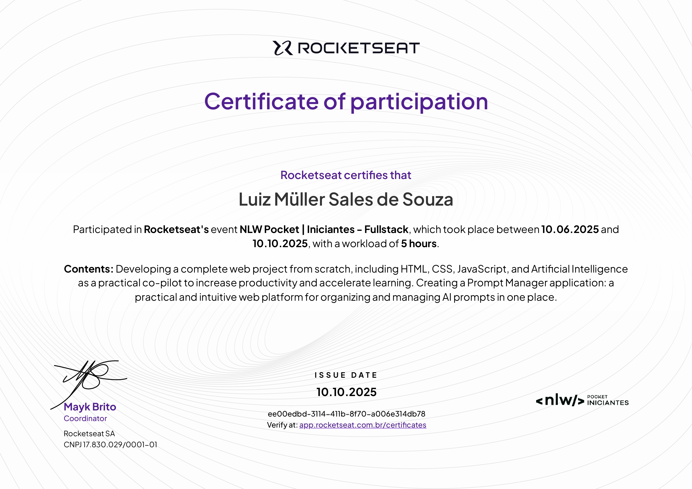
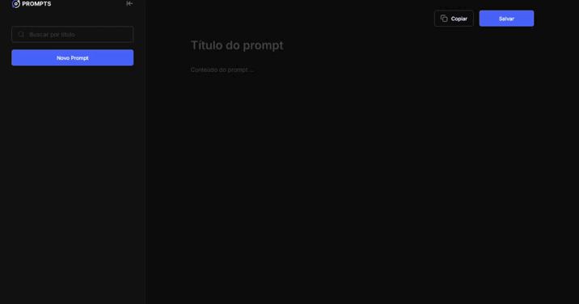
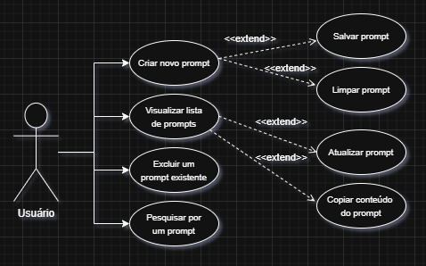

# 🌀 Prompts Manager

O Prompts Manager é uma aplicação simples feita em HTML, CSS e JavaScript, projetada para quem utiliza prompts diariamente para aumentar a produtividade, mas sente falta de um local centralizado para armazená-los. Esta ferramenta é focada em organizar seus comandos, reduzir o tempo de execução de tarefas e, futuramente, sincronizar suas anotações na nuvem.

Atualmente, o projeto consiste no Front-End da aplicação, utilizando `localStorage` para o armazenamento de dados. Isso significa que os prompts são salvos no cache do navegador e permanecem na sua máquina local, podendo ser perdidos se o cache for limpo.

### Ações implementadas:

* **Interface Intuitiva:** Um editor limpo para inserir o título e o conteúdo do prompt.
* **Alertas Informativos:** Mensagens de auxílio que guiam o usuário durante o uso.
* **Ações Rápidas:** Botões para salvar o prompt atual ou copiar seu conteúdo para a área de transferência.
* **Gerenciamento de Prompts:** Crie quantos prompts desejar, salve-os na lista e remova-os facilmente.

A aplicação está configurada para deploy no GitHub Pages, visando validar a adaptação dos usuários a este sistema de organização.

---

## 📜 Certificado de Conclusão

Para validar ainda mais as habilidades demonstradas neste projeto, segue o certificado obtido após a conclusão do curso/treinamento relacionado ao desenvolvimento desta aplicação:

<div align="center">

| Certificado |
|:---:|
|  |

</div>

---

## 🗝️ Como Utilizar a Aplicação

A aplicação foi upada dentro do GitHub Pages para um acesso público, podendo ser acessado pela seguinte URL:

**URL da Aplicação:** [https://luizmullersouza.github.io/PromptsManager/](https://luizmullersouza.github.io/PromptsManager/)

Você pode usar o navegador e o dispositivo de preferência para acessar a URL, a mesma está responsiva a dispositivos móveis.

---

## 🚀 Demonstração da Aplicação

Uma visão geral de como a aplicação funciona, mostrando o fluxo principal de uso, desde a criação até o salvamento e a listagem de prompts.

<div align="center">

| Demonstração |
|:---:|
|  |

</div>

---

## 🗃️ Documentação em Diagrama

Aqui está um simples Diagrama de Caso de Uso que informa como será a interação do usuário com o sistema aplicado.

<div align="center">

| Diagrama |
|:---:|
|  |

</div>

---

## 🚀 Guia para Baixar o Repositório

Para baixar este repositório em sua máquina, siga os seguintes passos:

#### Passo 1: Instale o Git (Opcional)

**A) Instalação do Git**

Git é o sistema que usamos para gerenciar e compartilhar código. Se você não o tem instalado:
1.  **Acesse o site oficial:** Vá para [git-scm.com/downloads](https://git-scm.com/downloads).
2.  **Baixe e Execute o Instalador:** Siga as instruções para o seu sistema operacional. No Windows, você pode clicar em "Next" em todas as janelas.
3.  **Verifique a Instalação:** Abra um terminal (Git Bash) e digite `git --version`. Se a versão aparecer, está pronto!

#### Passo 2: Obtenha os Arquivos do Projeto

**Opção A: Download Direto**

1.  Na página principal deste repositório, clique no botão verde **`< > Code`**.
2.  No menu que aparecer, clique em **`Download ZIP`**.
3.  Salve o arquivo e descompacte a pasta no seu computador.

**Opção B: Clonando com Git**

1.  Abra seu terminal (Git Bash, PowerShell, etc.).
2.  Navegue até o diretório onde você quer salvar os projetos.
3.  Execute o comando:
    ```bash
    git clone [https://github.com/LuizMullerSouza/PromptsManager.git](https://github.com/LuizMullerSouza/PromptsManager.git)
    ```

---

### 👨‍💻 Autor

Obrigado por conferir este projeto!

* **GitHub:** [LuizMullerSouza](https://github.com/LuizMullerSouza)
* **Instagram:** [@luizmullerz](https://www.instagram.com/luizmullerz/)

Uma ótima lógica de programação a todos e bons códigos!